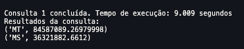
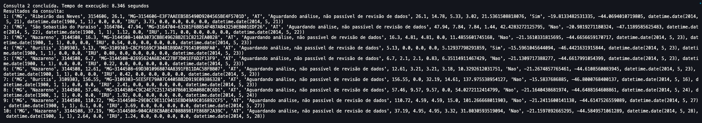
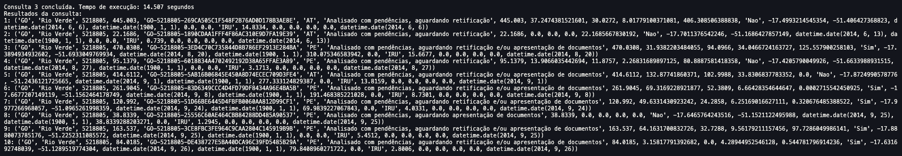

# Projeto: Análise e Processamento de Dados do SICAR

**Colaboradores:**
- Alex Mendonça
- Breno Lima
- Fernando Soutto
- Raul Carvalho
- Thaís Gonçalves

## Descrição Geral
Este projeto tem como objetivo realizar o processamento e análise de dados do Sistema Nacional de Cadastro Ambiental Rural (SICAR).
A aplicação foi projetada para manipular grandes volumes de dados (mais de 6 milhões de registros) de forma eficiente, utilizando tecnologias de containerização, bancos distribuidos e ferramentas de análise.

## Objetivos
* **Ingestão e Processamento:** Processar e transformar grandes volumes de dados utilizando tecnologias escaláveis.
* **Armazenamento de Dados:** Utilizar um banco de dados distribuído (Citus/PostgreSQL) para gerenciar e consultar os dados.
* **Análise e Insights:** Executar consultas avançadas para extrair insights, como:
  * Soma de áreas por região ou estado.
  * Identificação de propriedades em áreas específicas delimitadas por polígonos.
* **Apresentação de Resultados:** Gerar tabelas e relatórios para suportar decisões estratégicas.

## Tecnologias Utilizadas
* **Docker:**
  * Utilizado para containerizar os serviços do projeto, garantindo portabilidade e fácil configuração do ambiente.
  * **Serviços configurados:**
    * Coordenador (``citus-coordinator``): Gerencia o banco de dados distribuído.
    * Workers (``citus-worker-1``, ``citus-worker-2``, ``citus-worker-3``): Executam consultas paralelamente.
* **PostgreSQL + Citus:**
  * Banco de dados relacional escalável, configurado para armazenar grandes volumes de dados.
* **Python:**
  * **Bibliotecas:**
    * **Pandas**: Para leitura e manipulação de arquivos CSV e estruturação dos dados.
    * **pycopg2:** Para interação com banco de dados PostgreSQL.
    * **dotenv:** Para gerenciamento seguro de variáveis de ambiente.
  * **Scripts:** Automação de tarefas como ingestão, criação de tabelas e execução de consultas.
* **VS Code:**
  * Ambiente de desenvolvimento utilizado para escrever, testar e executar os scripts Python.

## Fluxo de Dados
* **Ingestão dos Dados:**
  * Os dados originais estáo em formato CSV, contendo mais de 6 milhões de registros.
  * O arquivo é lido em lotes de 1000 registros para evitar sobrecarga de memória durante a ingestãoo no banco de dados.
* **Armazenamento:**
  * Os dados são armazenados em uma tabela no banco de dados PostgreSQL.
  * A tabela é distribuída utilizando o Citus para otimizar consultas em larga escala.
* **Processamento e Consultas**:
  * Consultas SQL são executadas para extrair insights, como:
    * Soma de áreas por estados/regiões/
    * Filtros baseados em coordenadas geográficas.
    * Identificação de propriedades dentro de áreas delimitadas.
* **Apresentação de Resultados:**
  * Resultados das consultas são armazenados em novas tabelas ou exportados para análise posterior.

## Principais Consultas Realizadas
### Soma das Áreas por Estado:
``sql
CREATE TABLE area_total_por_uf AS
SELECT uf AS estado, 
       SUM(area_liquida + area_remanescente_vegetacao_nativa + area_reserva_legal_proposta + area_preservacao_permanente + area_nao_classificada) AS area_total
FROM public.sicar_table
GROUP BY uf
ORDER BY area_total DESC;
``

### Filtragem de Propriedades por Região:
``sql
CREATE TABLE propriedades_sudeste AS
SELECT * 
FROM public.sicar_table
WHERE uf IN ('SP', 'RJ', 'MG', 'ES');
``

### Propriedades Dentro de Polígono:
``sql
CREATE TABLE propriedades_dentro_do_poligono AS
SELECT * 
FROM public.sicar_table
WHERE longitude BETWEEN -53.8181518 AND -51.0495971
  AND latitude BETWEEN -19.4632582 AND -16.1924262;
``

## Arquitetura do Projeto
1. Dados Oriniginais (CSV)
2. Ingestão (Python)
3. Banco de Dados Distribuídos
4. Consultas SQL e Análises
5. Armazenamento de Resultados em Novas Tabelas
6. Relatórios e Visualizações (via exportação ou consultas adicionais)